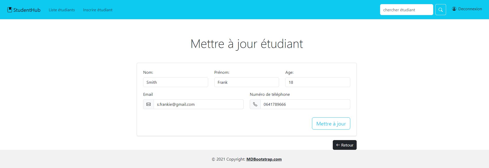

# StudentHub Application Java, Spring en MVC (model, view, controller)

## Application de gestion d'étudiants 

- Méthode CRUD en restcontroller et controller  
- Simulation d'une base de donnée dans le StudentService 

On souhaite créer une application web qui va nous permettre de gérer des étudiants, c'est-à-dire :

Créer un étudiant (nom, prénom, âge, email)
Lister tous les étudiants (nom et prénom)
Rechercher un étudiant par son nom
Voir le détail d'un étudiant

Il nous faudra donc plusieurs pages web (au minimum) :

- Accueil
- Inscription
- Liste des étudiants
- Détails d'un étudiant
- Résultat de la recherche d'un étudiant

On pourra, à partir de la page d'accueil, se rendre sur :

- La liste des étudiants
- La page d'inscription
- Faire une recherche d'un étudiant

Sur la page d'inscription, il sera possible de :

- Remplir un formulaire et être redirigé vers la page liste des étudiants
- Revenir à l'accueil

Sur la page de la liste des étudiants :

- À côté de chaque étudiant (seul le nom et le prénom sont affichés), un lien ou un bouton "Voir détails" pour accéder à la page des détails de l'étudiant
- Un lien ou un bouton pour revenir à l'accueil

La page de détails de l'étudiant :

- Affiche toutes les informations d'un étudiant
- Un bouton ou un lien pour revenir à la liste
- Un bouton ou un lien pour revenir à l'accueil

La page de recherche :

- Affiche la liste des étudiants trouvés et un bouton ou un lien pour voir les détails de l'étudiant.
OU
- Affiche "Aucun résultat trouvé"
- Un bouton ou un lien pour revenir à l'accueil

.png)
.png)

.png)

