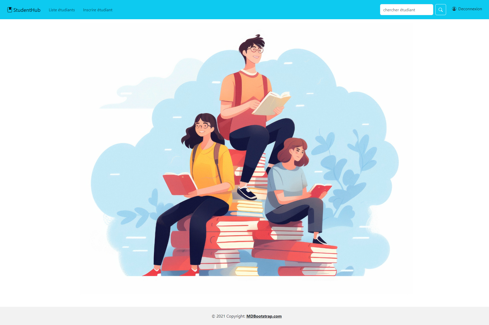
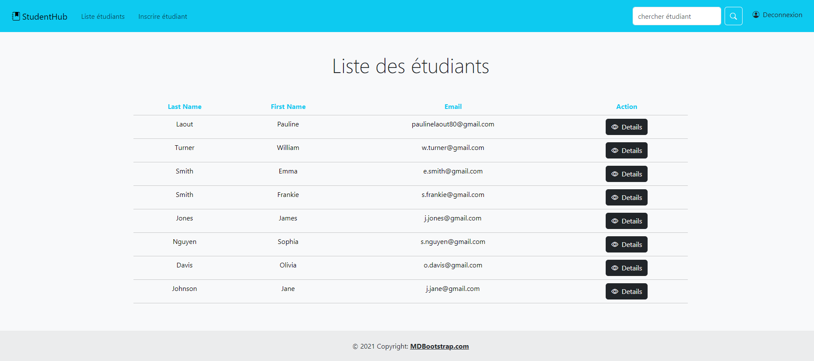
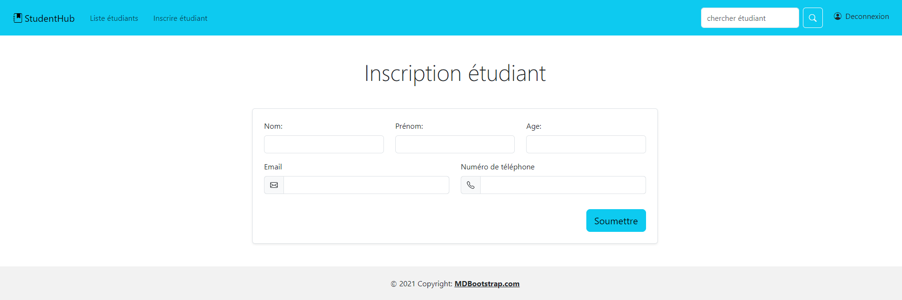
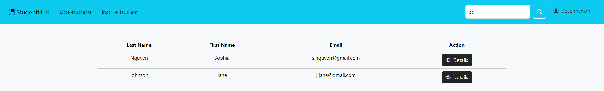

# StudentHub Application Java, Spring en MVC (model, view, controller)

Application de gestion d'étudiants 

-Simulation d'une base de donnée dans le StudentService 
-Méthode Get et Post dans le StudentController

 

.png>) 

.png>) 

 

