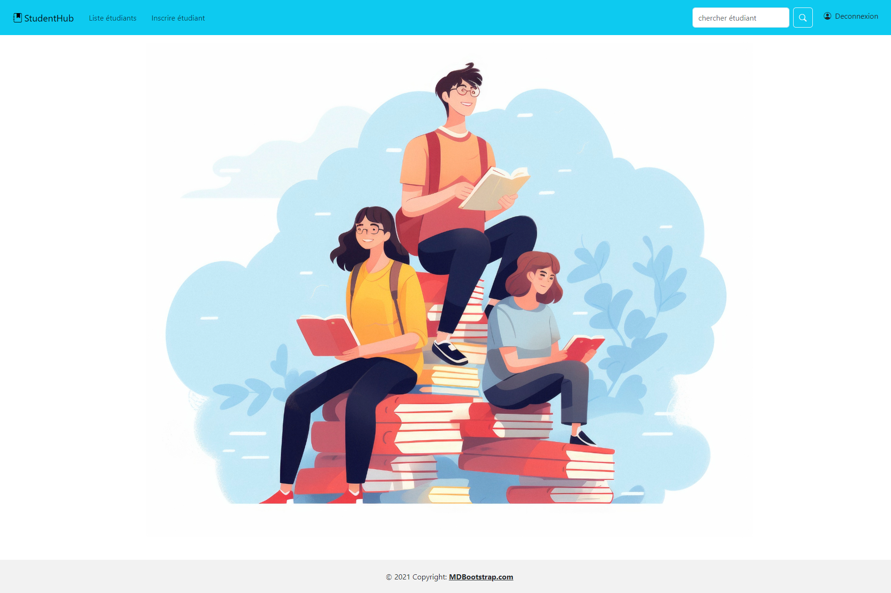
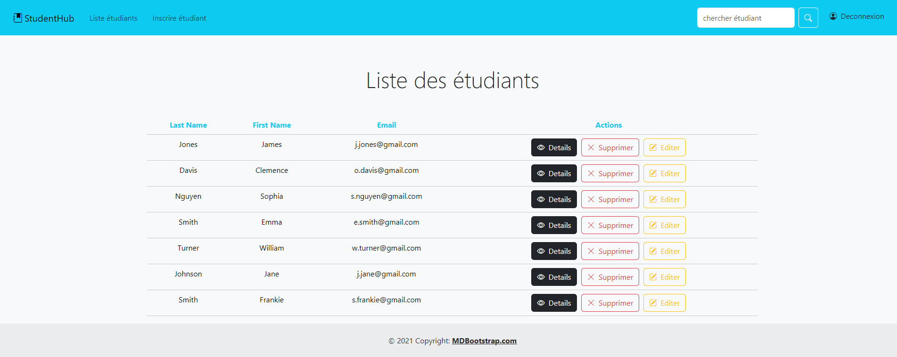
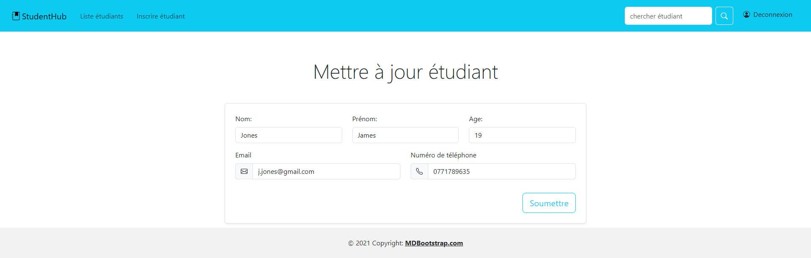

# StudentHub Application Java, Spring en MVC (model, view, controller)

Application de gestion d'étudiants 

-Méthode CRUD en restcontroller et controller
-Simulation d'une base de donnée dans le StudentService 

.png)
.png)
.png)

