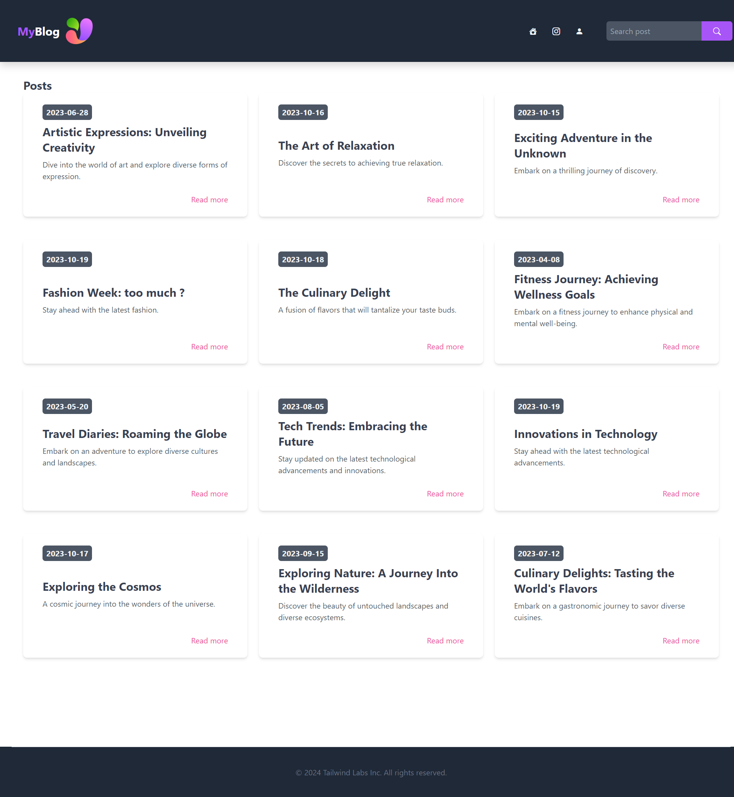
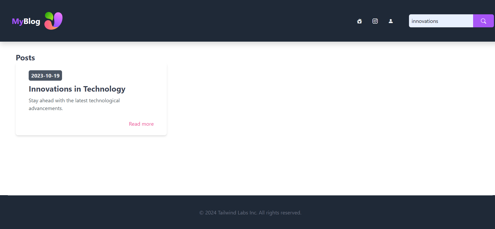
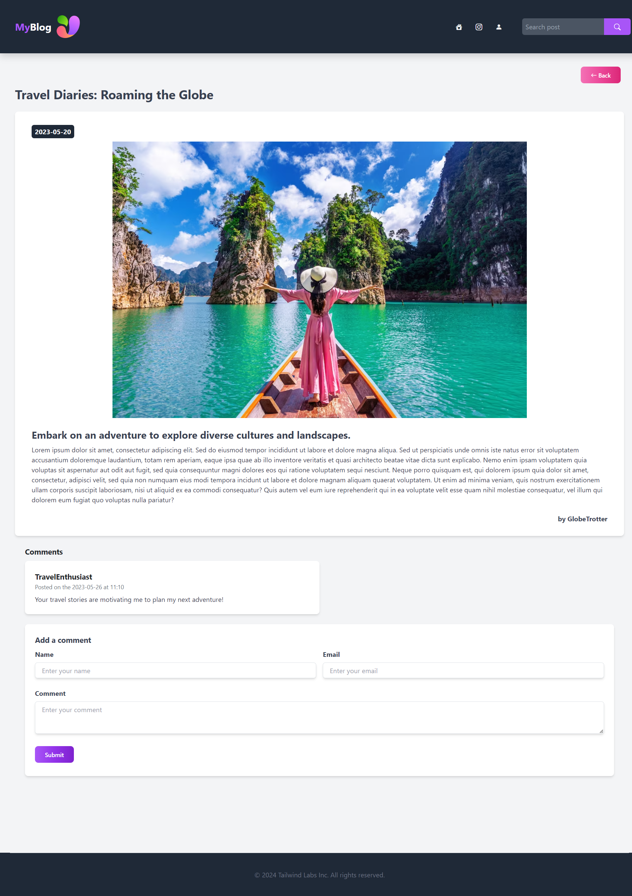
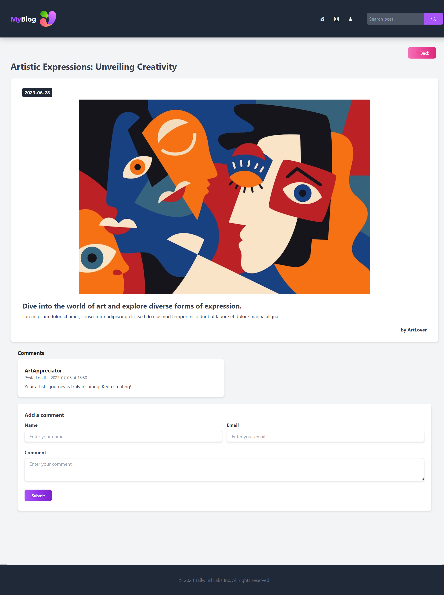

# SpringBoot, Java, Tailwindcss

On souhaite développer une application de blog.

Celle-ci nous permettra de publier des articles, tout en offrant la possibilité aux utilisateurs de laisser des commentaires pour chaque article.

Chaque article devra contenir au minimum les éléments suivants :

Titre
Description
Contenu
Chacun de ces articles pourra être accompagné d'un ou plusieurs commentaires comprenant les informations suivantes :

Nom
Adresse e-mail
Contenu

Cette application nous permettra de consulter et de publier des articles ainsi que des commentaires, tant dans une version MVC que dans une version API.

